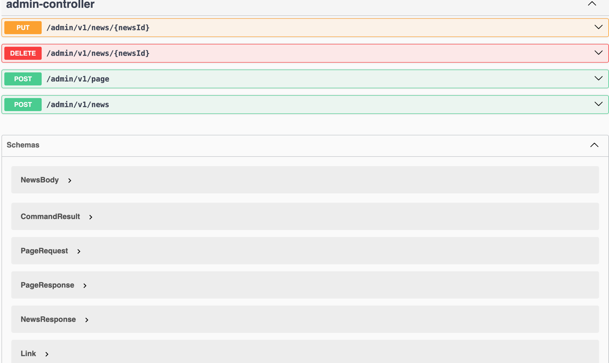
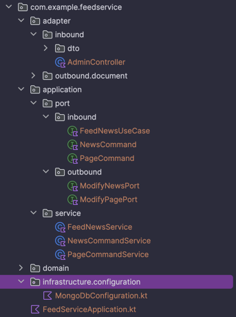
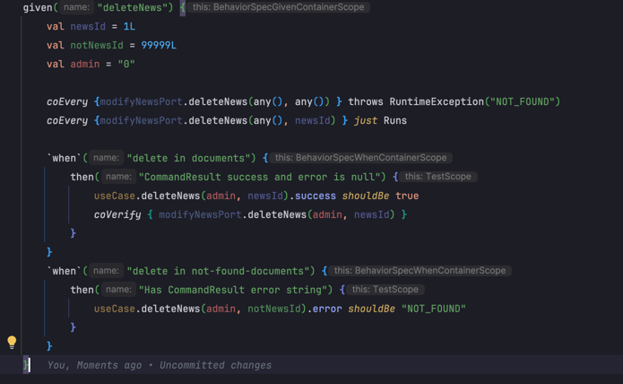
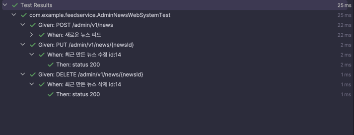

 

## 개요
JDK21 + SpringBoot 3.2.x + MongoDB 7.x 를 사용했습니다.


## 구동 
### JDK21 이 설치 되 있어야 합니다.
```bash
curl -s "https://get.sdkman.io" | bash
source "$HOME/.sdkman/bin/sdkman-init.sh"
sdk install java 21.0.1-zulu
sdk use java 21.0.1-zulu
```
### MongoDB 컨테이너생성
**feed** 라는 데이터베이스가 자동으로 만들어 집니다.
```bash
cd docker
docker-compose up --build -d mongodb 
cd ..
```
### 스프링 기동
```bash
./gradlew build
./gradlew bootRun
```

## API
```
localhost:8080/admin/v1/page" 
```
### Swagger 
http://localhost:8080/webjars/swagger-ui/index.html


## Architecture
* 클린아키텍쳐를 지향합니다.
* 헥사고날 아키텍처를 지행하여 도메인, 비즈니스로직, 어댑터, 인프라스트럭쳐를 분리합니다.
* 도메인에는 최대한 기술적 요소를 배제 합니다.
* 비즈니스로직이 중심 도메인에서 벗어나, 퍼시스턴스나, 어댑터, 인프라스트럭쳐에 존재 하지 않게 합니다.
* 순환참조를 배제하고 외부로직이 내부로 행하는 구조를 만듭니다.
* 내부에서는 의존성 역전으로 포트를 통한 인터페이싱을 합니다.
* REST API 명세를 지향합니다.

## 패키지 구조


## Test
```bash
./gradlew test --rerun 
```
* TDD 를 지향 합니다.
* Mock 객체와 UseCase 를 테스트하는 통합 테스트를 수행합니다.
* BDD 를 사용한 인수테스트와 비즈니스 로직 테스트를 수행합니다

### 통합테스트



### 시스템 인수 테스트



